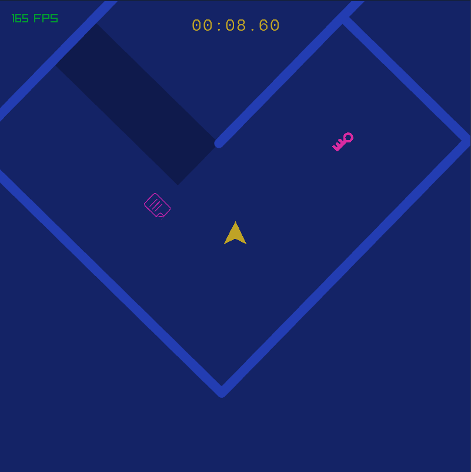

## ByteRacer

### Description

A fun racing game with a story!

### Controls

Keyboard/Mouse:

 - WASD/Arrow keys - Move
 - R - Restart/retry
 - Scroll - Move through main menu

### Building

Run CMake and build. CPM should pull in everything for you.

### Links

 - itch.io Release: $(itch.io Game Page)

### License

This project is licensed under the GNU GPLv3 license. See the [LICENSE](LICENSE) file for more information.

